# Algorithm Note

Tags:  `algorithm`, `data structure`

[TOC]

## 前言

算法与数据结构，首先要理解数据结构，才能理解算法。虽然名字只有算法笔记，但是会记下所有的数据结构的实现，再去写相关的算法，以及stl标准库的应用。

## 复杂度

理解复杂度的概念，复杂度分为时间与空间的复杂度。时间上，又分为最好，最坏和平均的复杂度。一般考虑平均和最坏的情况。空间上，主要看存储用了什么数据结构。
复杂度只和输入数据的量n挂钩，不会考虑其他参数。

* O(1):复杂度为常量，时间上只进行了有限次操作，空间上只存储了几个变量
* O(logn):对数级别，通常用了二分法，二叉树等算法，可以达到这个复杂度级别。想要用二分法，通常要求传入数据已经是有序的。
* O(n):线性级别，通常经历了一次或者有限次遍历，空间上可能存储了n个变量。O(n)是对无序数组，也包括字符串通常能达到的最好水平，因为需要完整遍历一次数据才能得到最优解。
* O(nlogn):一般是对数据进行了排序操作，或者进行了n次二分查找或者二叉树。
* O(n^2):指数级别，一般用了双重嵌套for循环，空间上，可能存储了二维数组。
* O(2^n):回溯法，dfs等算法。只能在数据量小的情况使用，否则必定超时。

复杂度只会考虑最大的那个，比如O(nlogn+n) = O(nlogn)。

## 数据结构

用来存储数据的结构，不仅自己会写，也要会用stl提供的标准库。
常用的数据结构包括链表，栈，队列，优先级队列，树，平衡树，哈希表，图等等。会不断进行补充。

### 链表

链表一般都是单链表。头插尾插都是O(1)级别，中间插入删除搜索都是O(N)。一般用结点存数据，如果用数组，需要考虑扩充上限的问题。

```cpp
template <typename T>
struct ListNode {
    T data;
    ListNode *next;
};
ListNode head;
```

使用链表，一般用stl标准库里的`std::vector`，它的实现方式其实是数组，但是可以自动扩充，因此使用时不需要考虑内存问题。
可以使用迭代器访问数组中元素，也可以直接用下标访问。
`vector`常用的功能包括尾接，尾删，查看大小，和判空。

```cpp
#include <vector>
std::vector<int> vec{1,2,3,4,5};
for(auto iter = vec.begin(); iter != vec.end(); iter++) {
    cout << *iter << endl ;// 迭代器的解引用
    cout << vec[i] << endl;// 等价
}
vec.push_back(0);
vec.pop_back();
int n = vec.size();
if (vec.empty()) {
    return;
}
```

### 栈

栈的存储是和链表类似的，但是栈只能访问顶部的数据。满足先进后出原则，入栈和出栈都在顶部。只提供一个始终指向最顶部数据的指针。

```cpp
template <typename T>
struct Stack {
    T data;
    Stack *next;
};
Stack *top;
```

栈一般不需要自己实现。同样用标准库提供的`std::stack`即可。
`stack`常用功能包括入栈，出栈，获取栈顶，判空等。

```cpp
#include <stack>;
std::stack<int> st;
st.push(1);
if (!st.empty()) {
    int i = st.top();
    st.pop();
}
```

### 队列

队列也类似于链表，满足先进后出原则。入队数据在队尾，而出队数据出在队首。使用队列，需要保存指向队首和队尾的两个指针。

```cpp
template <typename T>
struct Queue {
    T data;
    Queue *next;
};
Queue *front, *end;
```

队列同样不需要自己写实现，一般用标准库提供的`std::queue`就可以了。
`queue`提供入队出队，判空，取队首队尾的操作。

```cpp
#include <queue>;
std::queue<int> que;
que.push({1,0});
if (!que.empty()) {
    int i = que.front();
    que.pop();
}
```

### 优先级队列

也叫二叉堆，它的特点是队首始终为数据里最大或者最小的。以最小堆为例，它的子节点会大于它本身。
实现二叉堆，一般用动态数组，不用结点的原因是，i/2刚好是i的父结点，比较好处理。对于优先级队列，需要考虑插入后，维持堆特性的过程，称之为向下过滤。

```cpp
//用最小堆存储最大的k组数据。
template <typename T>
class Priority_queue {
private:
    T *data;
    int count;
public:
    Priority_queue(int k) {
        data = new T[k+1];//会从data[1]开始存数据。
        count = 0;
    }
    void push(T i) {
        if (count < k) {
            ++count;
            int t = count;
            while (t > 1 && i < data[t/2]) {
                data[t] = data[t/2];
                t /= 2;
            }
            data[t] = i;
        } else if (i > data[1]) {
            int t = 1;
            while (i > que[t]) {
                t *= 2;
                if (t > k) {
                    break;
                } else if (t < k && que[t] > que[t + 1]) {
                    ++t;
                }
                if (i > que[t]) {
                    que[t / 2] = que[t];
                } else {
                    break;
                }
            }
            que[t / 2] = i;
        }
    }
};
```

自己写优先级队列很困难，最好还是用标准库提供的`std::priority_queue`实现。
`priority_queue`可以指定为大小堆，提供入堆，出堆，判空，取顶操作。

```cpp
#include <queue>;
std::priority_queue<int> que;//默认最大堆
std::priority_queue<int, std::vector<int>, std::greater<int>> que;//最小堆
que.push(1);
if (!que.empty()) {
    int i = que.top();
    que.pop();
}
```

### 树

树的结构非常多，普通的有二叉树，多叉树等。对于普通二叉树，需要掌握其遍历方式，包括前序，中序，后序，层次遍历四种遍历方法。对于搜索树，包括二叉搜索树，AVL树，红黑树，AA树等。对于这些树，需要掌握插入和删除时，如何维持树的平衡性。子结点不为2个时，变为B树和B+树。

stl标准库里没有树的结构，但是有用红黑树原理实现的映射`std::unordered_map`。
因此需要自己实现树的相关算法。

#### 二叉树

二叉树每个结点存一个数据，并且有2个指向左右子节点的指针。只存储根节点的指针用来调用。

```cpp
template <typename T>
struct TreeNode {
    T data;
    TreeNode *left, *right;
};
TreeNode *root;
```

##### 前序遍历

前序遍历的顺序是先根结点，再左右子结点。遍历通常用递归函数实现，为了避免函数栈溢出，也可以用栈实现。

```cpp
void preorder(TreeNode *p) {
    if (p == nullptr) {
        return;
    }
    std::cout << p->data << '\t';
    preorder(p->left);
    preorder(p->right);
}

void preorder(TreeNode *root) {
    if (root == nullptr) {
        return;
    }
    std::stack<TreeNode*> st;
    TreeNode *cur = root;
    st.push(cur);
    while (!st.empty()) {
        cur = st.top();
        std::cout << cur->data << '\t';
        st.pop();
        if (cur->right) {
            st.push(cur->right);
        }
        if (cur->left) {
            st.push(cur->left);
        }
    }
}
```

##### 中序遍历

中序遍历的顺序是先遍历左结点，然后是父结点，最后是右结点。中序遍历同样可以用递归实现，但是也可以用栈实现。相比于前序遍历，栈实现会相对复杂。

```cpp
void midorder(TreeNode *p) {
    if (p == nullptr) {
        return;
    }
    midorder(p->left);
    std::cout << p->data << '\t';
    midorder(p->right);
}

void midorder(TreeNode *root) {
    if (root == nullptr) {
        return;
    }
    std::stack<TreeNode*> st;
    TreeNode *cur = root;
    while (!st.empty() || cur != nullptr) {
        while (cur != nullptr) {
            st.push(cur);
            cur = cur->left;
        }
        cur = st.top();
        std::cout << cur->data << '\t';
        st.pop();
        cur = cur->right;//这一步，避免cur一直在重复的左链里
    }
}
```

##### 后续遍历

后续遍历的顺序是先左右结点，再遍历父结点。这种遍历方法使用非递归实现是最为复杂的。

```cpp
void postorder(TreeNode *p) {
    if (p == nullptr) {
        return;
    }
    postorder(p->left);
    postorder(p->right);
    std::cout << p->data << '\t';
}

void postorder(TreeNode *root) {
    if (root == nullptr) {
        return;
    }
    std::stack<TreeNode*> st;
    TreeNode *cur = root, *pre = nullptr;
    while (!st.empty() || cur != nullptr) {
        while (cur != nullptr) {
            st.push(cur);
            cur = cur->left;
        }
        cur = st.top();
        if (cur->right == nullptr || cur->right == pre) {
            st.pop();
            std::cout << cur->data << '\t';
            pre = cur;
            cur = nullptr;
        } else {
            cur = cur->right;
        }
    }
}
```

##### 层次遍历

层次遍历会按照树的层数进行遍历，很显然这是用队列实现的。

```cpp
void levelorder(TreeNode *root) {
    if (root == nullptr) {
        return;
    }
    std::queue<TreeNode*> que;
    TreeNode *p = root;
    que.push(p);
    while(!que.empty()) {
        p = que.front();
        std::cout << p->data << '\t';
        que.pop();
        if (p->left) {
            que.push(p->left);
        }
        if (p->right) {
            que.push(p->right);
        }
    }
}
```

#### 二叉搜索树

让二叉树实现搜索的功能，需要有序存储数据。原理就是，比当前结点大的数存到右结点，小的数存到左节点。这样的搜索树的搜索性能是O(logn)的。
对二叉搜索树进行中序遍历，就可以以顺序输出存储的数据。
二叉树的删除最为复杂，需要考虑删除的结点有几个子结点的问题。如果有2个子结点，需要把他右子树的最左结点替换删除。删除通过栈实现。

```cpp
void insert(T i) {
    TreeNode *p = root;
    if (p == nullptr) {
        root = new TreeNode(i);
        return;
    }
    while (true) {
        if (p->data == i) {
            return;
        } else if (p->data < i) {
            if (p->right == nullptr) {
                p->right = new TreeNode(i);
                return;
            }
            p = p->right;
        } else {
            if (p->left == nullptr) {
                p->left = new TreeNode(i);
                return;
            }
            p = p->left;
        }
    }
}

TreeNode* find(T i) {
    TreeNode *p = root;
    while (p != nullptr) {
        if (p->data == i) {
            break;
        } else if (p->data < i) {
            p = p->right;
        } else {
            p = p->left;
        }
    }
    return p;
}

void remove(T i) {
    TreeNode *cur = root;
    TreeNode *parent = nullptr;
    while (p != nullptr && p->data != i) {
        parent = p;
        if (p->data > i) {
            p = p->left;
        } else {
            p = p->right;
        }
    }
    if (p == nullptr) {
        return;
    }

    if (p->left != nullptr && p->right != nullptr) {
        TreeNode *minNode = p->right;
        TreeNode *minNodeParent = p;
        while (minNode->left != nullptr) {
            minNodeParent = minNode;
            minNode = minNode->left;
        }
        p->value = minNode->value;
        p = minNode;
        parent = minNodeParent;
    }

    TreeNode *child;
    if (p->left != nullptr) {
        child = p->left;
    } else {
        child = p->right;
    }
    if (parent == nullptr) {
        root = child;
    } else if (parent->left == p) {
        parent->left = child;
    } else {
        parent->right = child;
    }
    delete p;
}
```

#### AVL树

普通的二叉搜索树，当按顺序插入数据时，二叉搜索树会退化成链表，此时搜索的性能会将为O(n)，为了保持O(logn)的搜索性能，需要维持二叉树的形状。用平衡性来考虑二叉树的形状。对于一个二叉树，考虑它的左右子树的高度。如果它的每个结点的高度差都在1以内，就说明平衡性是好的。
AVL树是一颗满足平衡性能的二叉搜索树，在插入数据时，为了维持平衡性，它提出了对树进行旋转的操作。旋转分为四种，取决于新节点插入的位置，包括LL，LR，RL，RR。首先需要理解旋转的过程。
什么是旋转？本质上是对已有节点的连接关系进行再分配，旋转影响的层数最高为待旋转节点往上2层。首先看LL和RR的旋转过程。


注意，这里不要把新加入的节点当作最底层算了，因为观察每个节点的度数，失去平衡的节点最上层，而不是新加入的一层。
仔细看节点的位置变化，应该理解旋转过程本质上是对于节点之间连接的再分配。
标记顶层是N0，第一层是NL与NR，第二层是NLL，NLR，NRL，NRR。
那么LL的操作就是改变N0与NL之间的父子关系，由NL作为最顶层。改变了以后，NL本身的右孩子NLR没有了父亲，因为NL指向N0了，而N0原本指向的左孩子NL也没了，所以很合理地让N0指向NLR。这样就完成了LL旋转。
RR旋转是同理的，区别在于变为最顶层的是NR结点。LL与RR的实现代码如下。

```cpp
void LL(TreeNode *&p) {
    TreeNode *newp = p->left;
    p->left = newp->right;
    newp->right = p;
    p = newp;
}

void RR(TreeNode *&p) {
    TreeNode *newp = p->right;
    p->right = newp->left;
    newp->left = p;
    p = newp;
}
```

接下来考虑LR与RL的旋转过程，首先要看图示过程。


理解了前面的LL与RR以后，我们观察LR与RL操作后的结点变化。
LR的结果是NLR结点最终变成了根结点，它的左右子结点为NL与N0。这两个子结点失去了孩子，于是把NLR的两个孩子再分配给他们。
RL也是同理的，是LR的左右对称。LR与RL的代码实现如下。

```cpp
void LR(TreeNode *&p) {
    TreeNode *newp = p->left->right;
    p->left->right = newp->left;
    newp->left = p->left;
    p->left = newp->right;
    newp->right = p;
    p = newp;
}

void RL(TreeNode *&p) {
    TreeNode *newp = p->right->left;
    p->right->left = newp->right;
    newp->right = p->right;
    p->right = newp->left;
    newp->left = p;
    p = newp;
}
```

这里写的旋转函数，都用了指针的引用，这样可以改变旋转根节点指向的地址本身。
说明这一段时，没有详细说明为什么要这样旋转，对于AVL树来说，我们只需要知道哪个结点增加了新数据，并且向上更新每个父结点的高度即可。对于高度差到达2的结点进行一次旋转，就可以恢复这个结点的平衡。然而，一个结点恢复平衡，不代表它上面的结点还是平衡的。因此还需要继续向上查询高度。直到父节点本身是平衡的为止。最坏的情况，向上旋转会持续到根结点。
理解了旋转可以维持高度以后，还需要考虑的问题是，我怎么知道这个结点的高度呢？方法是在结点里保存高度height。那么当插入结点时，我要怎么维护自己的高度变化呢？叶结点的高度默认是1，对于父结点，它的高度是左右结点的较大值加一。更新高度后，还需要比较左右结点的高度差，如果高度差为2，就需要进行旋转。
注意到旋转以后，结点的高度会发生改变。因此，我们先回头考虑四个旋转后，高度受影响的结点。
LL旋转中，发生变化的其实只有N0与NL两个结点。而其他结点的子结点都不改变，因此自然高度也不会有改变。

RR同理，因此我们更新LL与RR函数，在旋转后更新N0的高度。

```cpp
int max(int a, int b) {
    return a > b ? a : b;
}
int getheight(TreeNode *p) {
    if (p == nullptr) {
        return 0;
    } else {
        return p->height;
    }
}
bool updateheight(TreeNode *p) {
    int height = 1 + max(getheight(p->left),getheight(p->right));
    if (p->height == height) {
        return false;
    }
    p->height = height;
    return true;
}
void LL(TreeNode *&p) {
    TreeNode *newp = p->left;
    p->left = newp->right;
    newp->right = p;
    updateheight(p);
    updateheight(newp);
    p = newp;
}
void RR(TreeNode *&p) {
    TreeNode *newp = p->right;
    p->right = newp->left;
    newp->left = p;
    updateheight(p);
    updateheight(newp);
    p = newp;
}
```

接下来考虑LR与RL函数。LR中，高度改变的结点分别是N0，NL与NLR。同样参考下图的高度变化。
虽然看似可以在NLR的左右结点插入新数据，但是不会对这3个结点的高度变化发生影响。
因此我们在LR与RL函数里更新这3个结点的高度。


```cpp
void LR(TreeNode *&p) {
    TreeNode *newp = p->left->right;
    p->left->right = newp->left;
    newp->left = p->left;
    p->left = newp->right;
    newp->right = p;
    updateheight(newp->left);
    updateheight(newp->right);
    updateheight(newp);
    p = newp;
}
void RL(TreeNode *&p) {
    TreeNode *newp = p->right->left;
    p->right->left = newp->right;
    newp->right = p->right;
    p->right = newp->left;
    newp->left = p;
    updateheight(newp->left);
    updateheight(newp->right);
    updateheight(newp);
    p = newp;
}
```

写好了四个旋转函数，终于我们可以实现插入与删除的操作了。查找与普通的二叉搜索树一样，因此就不用再重复实现了。对于插入和删除，因为需要一直向上考虑，因此需要用栈来存储所有的父节点。

```cpp
struct TreeNode {
    int height;
    T data;
    TreeNode *left, *right;
    TreeNode(T i) {
        left = nullptr;
        right =nullptr;
        height = 1;
        data = i;
    }
}
int getdegree(TreeNode *p) {
    int left = getheight(p->left);
    int right = getheight(p->right);
    return left - right;
}

void insert(T i) {
    TreeNode *p = root;
    if (p == nullptr) {
        root = new TreeNode(i);
        return;
    }
    std::stack<TreeNode*> st;
    while (p != nullptr) {
        st.push(p);
        if (p->data == i) {
            return;
        } else if (p->data < i) {
            p = p->right;
        } else {
            p = p->left;
        }
    }
    p = st.top();
    if (p->data < i) {
        p->right = new TreeNode(i);
    } else {
        p->left = new TreeNode(i);
    }
    while (!st.empty()) {
        p = st.top();
        st.pop();
        if (!updateheight(p)) {
            return;
        }
        if (getdegree(p) < -1 || getdegree(p) > 1) {
            if (p->data > i) {
                if (p->left->data > i) {
                    LL(p);
                } else {
                    LR(p);
                }
            } else {
                if (p->right->data >i) {
                    RL(p);
                } else {
                    RR(p);
                }
            }
            if (st.empty()) {
                root = p;
            } else {
                TreeNode *q = st.top();
                if (p->data < q->data) {
                    q->left = p;
                } else {
                    q->right = p;
                }
            }
        }
    }
}
```

插入的查找添加新结点过程与普通二叉搜索树一致，插入完成后需要回溯栈，对原路线的结点高度进行考虑。旋转之后，需要更新父节点，连接到旋转后的结点上。否则父节点会连接到子结点，导致存储数据丢失。
删除函数则更为复杂，基本的原理和普通删除一样，遇到2个结点的情况，需要替换并删除右子树的最左结点。这时候同样需要递归检查高度变化。由于删除与插入的方向是相反的，所以如果在左边删除，则需要对右子树进行旋转。
这时候要怎么考虑左旋右旋的问题呢？我们总是尽可能选择操作少的方式，因此我们再考虑另一个子树的度数。只要不是内侧的子树高度更高，就可以使用LL或者RR完成旋转。否则，我们就只能使用LR和RL进行操作。

```cpp
void remove(T i) {
    TreeNode *p = root;
    TreeNode *parent = nullptr;
    std::stack<TreeNode*> st;
    while (p != nullptr) {
        if (p->data == i) {
            break;
        } else if (p->data < i) {
            st.push(p);
            parent = p;
            p = p->right;
        } else {
            st.push(p);
            parent = p;
            p = p->left;
        }
    }
    if (p == nullptr) {
        return;
    }
    if (p->left && p->right) {
        TreeNode *child = p->right;
        TreeNode *childp = p;
        st.push(p);
        while (child->left != nullptr) {
            st.push(child);
            childp = child;
            child = child->left;
        }
        p->data = child->data;
        p = child;
        parent = childp;
    }
    TreeNode *child;
    if (p->left != nullptr) {
        child = p->left;
    } else {
        child = p->right;
    }
    if (parent == nullptr) {
        root = child;
    } else if (parent->left == p) {
        parent->left = child;
    } else {
        parent->right = child;
    }
    delete p;
    while (!st.empty()) {
        p = st.top();
        st.pop();
        if (!updateheight(p)) {
            return;
        }
        if (getdegree(p) > 1) {
            if (getdegree(p->left) == -1) {
                LR(p);
            } else {
                LL(p);
            }
        } else if (getdegree(p) < -1) {
            if (getdegree(p->right) == 1) {
                RL(p);
            } else {
                RR(p);
            }
        }
        if (st.empty()) {
            root = p;
        } else {
            TreeNode *q = st.top();
            if (p->data < q->data) {
                q->left = p;
            } else {
                q->right = p;
            }
        }
    }
}
```

---

#### 红黑树

普通AVL树为了维持树的高度平衡，进行了大量的旋转操作，最终保证树的高度差不会超过2。但是它的旋转次数过多，导致了性能的降低。为了进行优化，提出了红黑树作为AVL树的改进。红黑树为了减少旋转次数，降低了树的平衡性，让树的高度差可以大于2。但是它依然保持了对数的查找性能。
利用红黑树的性质，可以保证其在插入与删除时，进行的旋转次数不超过3次。但是，这并不意味着它的操作降低到对数级别了。因为红黑树还有变色的操作，变色的次数依然是对数次的。
可以用下面这个可视化网站模拟红黑树的过程，加强理解。
[红黑树可视化](https://www.cs.usfca.edu/~galles/visualization/RedBlack.html)


红黑树首先满足二叉搜索树的全部要求，因此它的搜索效率是O(logn)的。此外，它给每个结点赋予了红色与黑色两种属性。并且满足：

1. 红色结点的子结点都是黑色，没有连续的红色结点。
2. 每个节点到nullptr结点的每条路径上，经过的黑节点个数相同。这里不会包含初始的结点本身的颜色。

此外，有些教材上还会加上以下两个条件，但是其实都不是强求的。

1. 根节点一定是黑色，是红色也不会影响算法。
2. 空叶子结点是黑色，这种要求一般会额外创建一个不包含数据的结点作为标识。我们知道这样会导致存储的结点数×2，浪费更多空间。这是没有必要的，我们可以直接考虑结点是nullptr的情形，把它作为黑色的考虑。

这里，我们先考虑以下红黑树的树高问题。按照要求，一颗全为黑色的红黑树也是红黑树，而每存在一个红结点，其父子都是黑结点，因此，红节点最多的情况是红色与黑色分层排满，并且树的高度不会超过黑节点层数的两倍。红节点的个数也不会超过黑结点个数的2倍。
由此我们可以推断出总的高度处于对数的级别。只要我们在插入删除时，维持红黑树的性质，就可以得到一颗O(logn)的查找树。

```cpp
struct TreeNode {
    T data;
    bool color;//false-black, true-red
    TreeNode *left, *right;
    TreeNode(T i, bool c = false): data(i), color(c) {
        left = nullptr;
        right = nullptr;
    }
};
```

##### 插入

红黑树插入时，我们知道插入黑色结点是不行的，因为必定会改变路径的黑色结点数。所以我们要插入红色的结点，如果插入的结点父节点是黑色的，插入就轻松完成了，如果是红色的，应该怎么进行调整呢？
如果只有2层，也就是根节点是红色的，这个时候直接把根节点变为黑色就可以了。为了省略这个过程，我们插入第一个节点时，就可以直接把它设为黑色的。
进入第3层，还是考虑N0,NL,NR,NLL,NLR,NRL,NRR的节点情况。假设我们插入在NLL上，NL是红色的节点。因为插入前，它就是颗红黑树，于是N0一定是黑色的节点。接下来，我们考虑NR是什么颜色的。简单情形是，NR是红色的，这时候，我们把NL与NR都改为黑色，就不会再出现连续的红节点。但是这时候，N0的黑高变高了，因为多了1层黑色的，为了维持高度不变，我们把N0也改为红色的。这样就算完成了吗？注意N0的父节点也有可能是红色，因此需要再往上进行颜色的调整。

另外一种情况，NR是黑色的，这种情况可能会比较反直觉，一边红一边黑，黑高是如何维持一致的？首先nullptr也要算成黑色，其次，我们总是会回溯上面的节点，这时候就有可能出现一边红色一边黑色的情形。结果还是依靠旋转进行操作。根据子结点插入的位置，我们用之前的LL，LR，RL，RR操作进行调整，并且调整颜色，可以发现，这一过程，没有改变原本的黑高。

而且N0结点的颜色也依然是黑色，说明我们不需要再往上检查了。
我们在旋转过程中调整颜色，观察一下会发现，只有N0和新的根结点会变色。但是我们不能直接在四个旋转函数里改变颜色，因为不仅是插入函数，在删除时，我们也会用到旋转，所以，我们在实现插入函数时，再改变结点的颜色。

```cpp
void LL(TreeNode *&p) {
    TreeNode *newp = p->left;
    p->left = newp->right;
    newp->right = p;
    p = newp;
}
void RR(TreeNode *&p) {
    TreeNode *newp = p->right;
    p->right = newp->left;
    newp->left = p;
    p = newp;
}
void LR(TreeNode *&p) {
    TreeNode *newp = p->left->right;
    p->left->right = newp->left;
    newp->left = p->left;
    p->left = newp->right;
    newp->right = p;
    p = newp;
}
void RL(TreeNode *&p) {
    TreeNode *newp = p->right->left;
    p->right->left = newp->right;
    newp->right = p->right;
    p->right = newp->left;
    newp->left = p;
    p = newp;
}
```

很好，接下来我们就完成插入函数，同样，我们用栈保存路径上的结点。

```cpp
void insert(T i) {
    TreeNode *p = root;
    if (p == nullptr) {
        root = new TreeNode(i);
        return;
    }
    std::stack<TreeNode*> st;
    while (p != nullptr) {
        st.push(p);
        if (p->data == i) {
            return;
        } else if (p->data < i) {
            p = p->right;
        } else {
            p = p->left;
        }
    }
    p = st.top();
    if (p->data < i) {
        p->right = new TreeNode(i, true);
    } else {
        p->left = new TreeNode(i, true);
    }
    if (p->color) {
        if (p == root) {
            p->color = false;
            return;
        }
        st.pop();
        bool flag = true;
        while (!st.empty()) {
            p = st.top();
            st.pop();
            if (p->color) {
                if (p == root) {
                    p->color = false;
                    return;
                }
                flag = true;
                continue;
            } else if (flag == false){
                return;
            }
            if (!comparecolor(p)) {//red,black
                p->color = true;
                if (p->data > i) {
                    if (p->left->data > i) {
                        LL(p);
                    } else {
                        LR(p);
                    }
                } else {
                    if (p->right->data > i) {
                        RL(p);
                    } else {
                        RR(p);
                    }
                }
                p->color = false;
                if (st.empty()) {
                    root = p;
                } else {
                    TreeNode *q = st.top();
                    if (p->data < q->data) {
                        q->left = p;
                    } else {
                        q->right = p;
                    }
                }
                return;
            } else {//red,red
                p->color = true;
                if (p->left){
                    p->left->color = false;
                }
                if (p->right){
                    p->right->color = false;
                }
                flag = false;
            }
        }
    }
}
```

注意我们更新颜色时的处理。代码的前半部分是正常的插入过程，之后我们需要迭代考虑颜色情况。我们要从插入结点的爷爷结点开始处理。我们用flag来表示此前是否存在连续双红的情况，如果没有，我们就能直接return，如果有，我们根据父辈结点的颜色分别进行不同的处理。
特别地，当处理到根节点时，我们直接把根节点变为黑色，并且return。
这里是否需要考虑根节点是红色，并且只有2层的情况？
虽然我们初始化时，已经把根节点设置为黑色的了，但是有可能经过删除操作后，会出现两层且为黑结点的情况。以防万一，我们也必须对2层时进行检查，保证它一直是一颗红黑树。

##### 删除

红黑树的删除最为复杂。首先，我们同样考虑删除结点的叶结点个数进行分类。对于有两个叶子的结点，我们找它的后继结点进行替换。删除结束后，我们需要维持红黑树的性质。
首先，假如我们删除的结点是红色的，那么就可以直接删除，不会破坏原有的红黑树。
假如是黑色的结点呢？删除结点，会导致根到这个结点上的黑高减少了1，就失去平衡了。我们考虑从删除结点的子结点处借一个结点来。首先，根据基本的二叉搜索树删除操作，我们只会面对删除0个子结点和1个子节点的情况。
首先是只有1个子结点的情况，因为一边是nullptr，所以子节点一定是红色的。否则红黑树原本就是不平衡的。我们把这个结点与父结点连接，再把它变为黑色，就维持了原来的平衡。
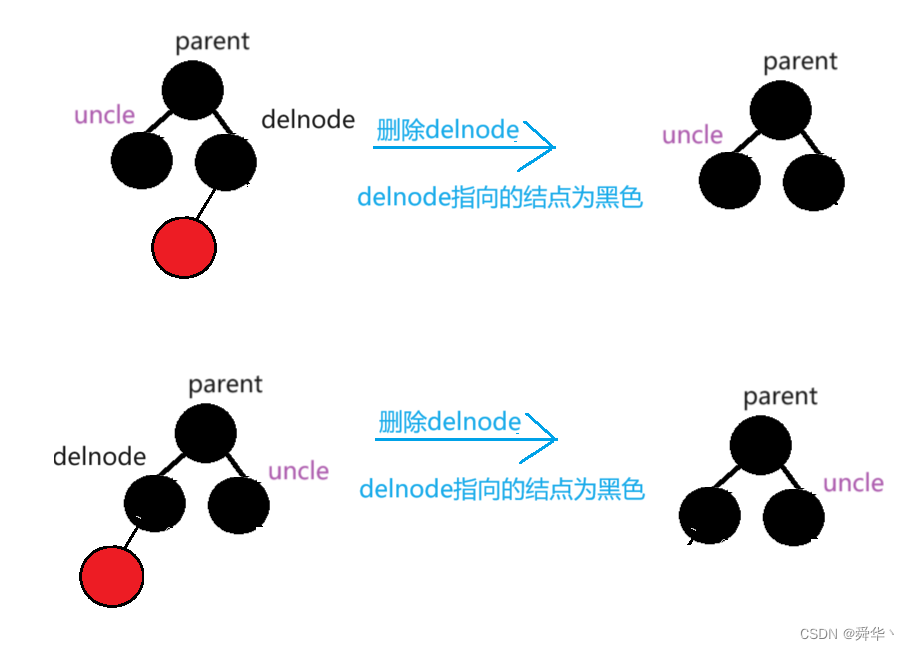
接下来必须面对删除没有子节点的黑叶结点了。因为不能把子节点变色，所以我们只能考虑父结点和兄弟结点的颜色情况。

1. 父节点是红色的。这时候，因为不能有连续的双红，因此兄弟结点也是黑色的。删除自己的话，要怎么维持平衡呢？
这个时候需要考察兄弟结点的子结点，有三种情况。
    1. 兄弟结点的子节点都是黑色的，也就是说，没有红色的子结点。我们把父结点改为黑色，把兄弟结点改为红色，就维持了黑高的平衡。因为整体的黑高没有改变，因此删除操作就完成了。
    2. 兄弟结点有红色的子节点。这时候把兄弟改成红色会出现连续双红的情况，没有办法了，只好进行旋转调整。如果红节点在外侧，那么一次外侧旋转可以完成操作。旋转完成后，把父节点和红色外节点变为黑色，把兄弟变为红色，就完成了调整的操作。因为这时候路径上的黑高也没有改变，所以完成了删除。
    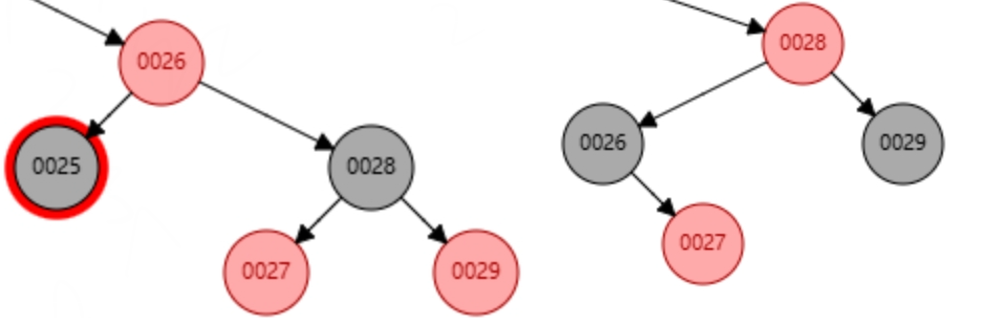
    3. 红色子节点在内侧。这时候进行一次内旋转可以完成调整，这一轮，只需要把父节点变为黑色就维持了原有的平衡，删除完成。
    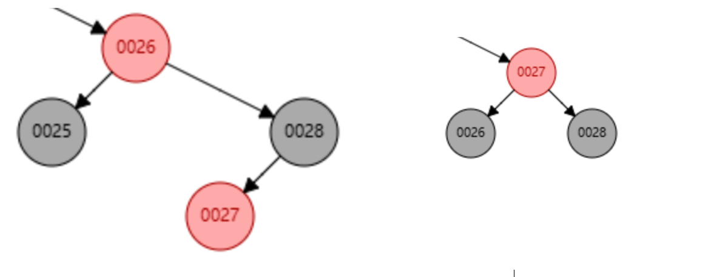
总结一下，父节点是红色的情况，最多只要一次旋转就能结束整个删除函数，也不需要向上回溯检查。研究变色情况，发现每一种情况下，原父节点的颜色都变成了黑色。而兄弟节点视情况调整颜色。
2. 父节点是黑色的。这时候，兄弟节点可能是红色，也可能是黑色的。我们同样需要对兄弟节点和它的子节点颜色进行分类讨论。
    1. 兄弟节点是红色的，那么兄弟节点的两个子节点肯定是黑色的。我们做一次外旋转，让兄弟节点成为父节点，改变它的颜色为黑色。而把父节点变为红色。这样就维持了原有的黑高。因此不需要再回溯检查了。
    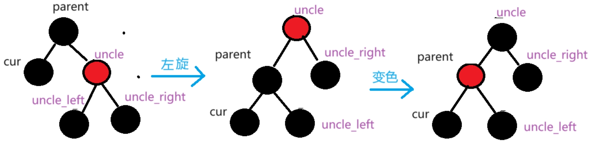
    2. 兄弟节点是黑色的，兄弟节点的子节点可能有2个黑节点，一个外红节点，一个内红节点三种情况。首先考虑兄弟节点的子节点都是黑色的情况。这时候，我们把兄弟节点变成红色，就完成了调整，但是整体的黑高降低了，我们需要再迭代考察上面的节点情况。
    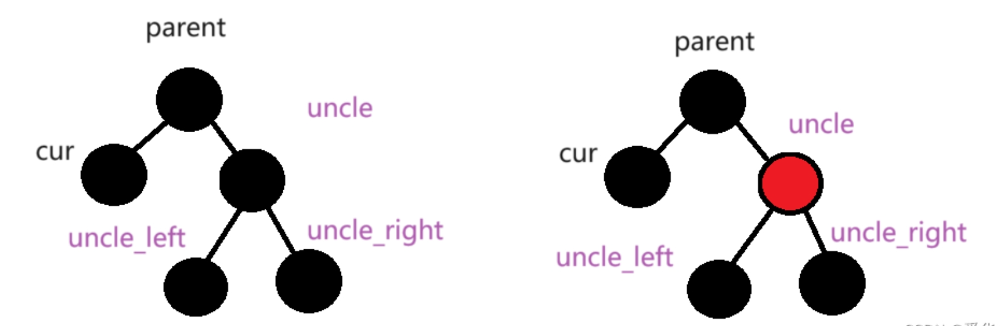
    3. 兄弟节点的外节点是红色的，我们做一次外旋转，让兄弟成为父节点，把外结点设为黑色，这时候，就维持了黑高的平衡，不需要再迭代了。并且，我们不需要考虑内结点是红色还是黑色的。
    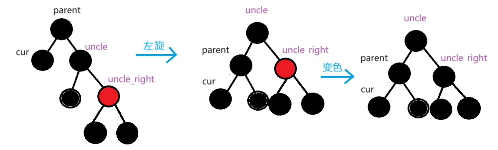
    4. 兄弟内节点是红色的，显然，我们需要进行内旋转了。我们把内结点旋转到父结点，并把它设置为黑色。这样，我们就维持了原本的黑高平衡。不需要再回溯迭代了。
    

我们总结一下，删除时，我们一共考虑了7种情形，其中只有一种情形需要回溯检查，其他的只需要最多一次旋转就结束了，相比AVL树，旋转确实简化了很多。代价是写的代码变得复杂了，我们需要对每种情况做好分类讨论。
因为需要分左右，所以总共是14种。
此外，我们还要注意最终回溯到根结点的情况，把根节点的子结点变色后，整体的黑高降低了，并且不需要再继续往上进行调整。在那时考察当前结点是不是根结点，进行处理。
最终的代码如下：

```cpp
void remove(T i) {
    TreeNode *p = root;
    TreeNode *parent = nullptr;
    std::stack<TreeNode*> st;
    while (p != nullptr) {
        if (p->data == i) {
            break;
        } else if (p->data < i) {
            st.push(p);
            parent = p;
            p = p->right;
        } else {
            st.push(p);
            parent = p;
            p = p->left;
        }
    }
    if (p == nullptr) {
        return;
    }
    if (p->left && p->right) {
        TreeNode *child = p->right;
        TreeNode *childp = p;
        st.push(p);
        while (child->left != nullptr) {
            st.push(child);
            childp = child;
            child = child->left;
        }
        p->data = child->data;
        p = child;
        parent = childp;
    }
    TreeNode *child;
    if (p->left != nullptr) {
        child = p->left;
    } else {
        child = p->right;
    }
    if (parent == nullptr) {
        root = child;
    } else if (parent->left == p) {
        parent->left = child;
    } else {
        parent->right = child;
    }
    //删除红结点
    if (p->color) {
        delete p;
        return;
    }
    delete p;
    //黑结点有一个子结点
    if (parent->data > i) {
        if (parent->left) {
            parent->left->color = false;
            return;
        }
    } else {
        if (parent->right) {
            parent->right->color = false;
            return;
        }
    }
    //黑结点无子结点。
    while (!st.empty()) {
        p = st.top();
        st.pop();
        if (p->color) {
            if (p->data > i) {//删除在左边，检查右边
                p->color = false;
                if (p->right->right && p->right->right->color) {//case2
                    p->right->color = true;
                    RR(p);
                    p->color = false;
                } else if (p->right->left && p->right->left->color) {//case3
                    RL(p);
                } else {//case1
                    p->right->color = true;
                }
            } else {
                p->color = false;
                if (p->left->left && p->left->left->color) {
                    p->left->color = true;
                    LL(p);
                    p->color = false;
                } else if (p->left->right && p->left->right->color) {
                    LR(p);
                } else {
                    p->left->color = true;
                }
            }
            if (st.empty()) {
                root = p;
            } else {
                TreeNode *q = st.top();
                if (p->data < q->data) {
                    q->left = p;
                } else {
                    q->right = p;
                }
            }
            return;
        } else {
            bool flag = true; //判断是否要迭代
            if (p->data > i) {//删除在左边，检查右边
                if (p->right->color) {//case1
                    p->color = true;
                    RR(p);
                    p->color = false;
                } else if (p->right->right && p->right->right->color) {//case3
                    RR(p);
                    p->color = false;
                } else if (p->right->left && p->right->left->color) {//case4
                    RL(p);
                    p->color = false;
                } else {//case2
                    p->right->color = true;
                    flag = false;
                }
            } else {
                if (p->left->color) {
                    p->color = true;
                    LL(p);
                    p->color = true;
                } else if (p->left->left && p->left->left->color) {
                    LL(p);
                    p->color = true;
                } else if (p->left->right && p->left->right->color) {
                    LR(p);
                    p->color = true;
                } else {
                    p->left->color = true;
                    flag = false;
                }
            }
            if (flag || st.empty()) {
                if (st.empty()) {
                    root = p;
                } else {
                    TreeNode *q = st.top();
                    if (p->data < q->data) {
                        q->left = p;
                    } else {
                        q->right = p;
                    }
                }
                return;
            }
        }
    }
}
```

代码写起来真的是相当的复杂，不过也是可以解释的，首先我们用了栈存储结点，而不是用递归函数，因此内存消耗会更小。考虑我们做旋转时的思路，其实重点关注的是兄弟结点的子结点的颜色。如果兄弟结点的3个颜色都是黑色，就进行变色，如果有红色，只要红色偏外侧，就用外旋转，只有内侧有红色时，才用内旋转。这样就完成了多种情况的分类讨论。

---

#### AA树

红黑树性能很好，但是写起来太复杂了。AA树是一种对红黑树的简化，它的插入和删除性能也维持在了O(logn)级别，但是略微不如红黑树。它在红黑树的基础上新增了一条要求：

1. 红色结点必须是右结点。

因为这个条件的限制，对AA树进行分类讨论的case减少了，但是与之对应的，处理的逻辑也会变得更加复杂。
AA树的基本操作与储存都与红黑树一致，同样也包含了四个旋转操作。我们主要分析AA树的插入与删除该怎么处理。

首先，我们用一种新的理解方式来看待AA树，也就是所谓的层级。这里，我们把根节点当作最高的一层，它的两个子结点，如果是黑结点，那么就是下一层，如果是红结点，那么它就看作和根节点同一层。
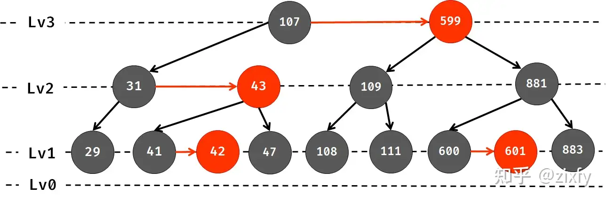
从图上能够更好地理解level的概念，实际上，拉伸调整一下AA树的形状，它就是一颗正常的红黑树。
在这个语境下，我们再来考虑一下红黑树黑高相等的含义，很容易理解，那就是所有的nullptr结点都在最下面一层。红结点与父结点总是在同一层的，所以不会影响到黑高。由此我们也可以断言，在第二层以上的结点总是满的，插入与删除总是发生在第一层上。
为了更直观地看待level水平，我们不再记录结点的颜色值，而是直接记录结点的level值，借此我们也能够通过根结点知道目前的AA树有多少层。

1. 对于结点N0，NR可以和N0同level，但是NRR必须比N0小，也就是说，不允许有连续的水平右路。
2. 对于左节点NL，它必定比N0小，也就是所，不能有水平左路。

对于AA树的基本操作已经不用过多叙述，我们同样有四个旋转函数用于处理插入删除时的情况。

1. 首先我们考虑，出现连续水平右路的情况。
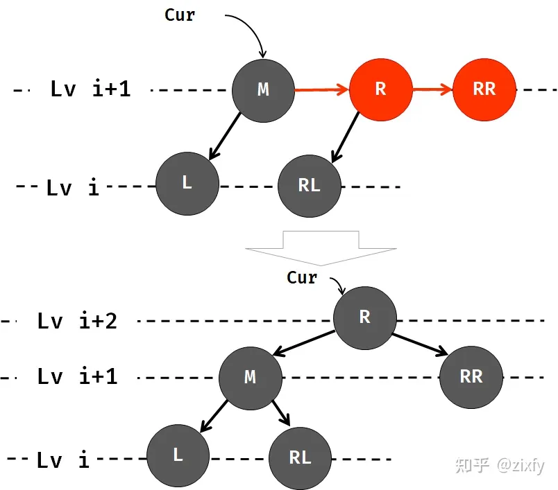
看图片的过程我们就理解了，连续水平右路做的处理实际是一次RR旋转，并且将NR结点的level增加了1。这一过程保证了当前的平衡。因为除了NR以外的level都不发生改变。但是需要向上继续调整，level增加以后，上方有可能会出现连续水平右路或者水平左路的情况。
2. 接下来我们考虑水平左路的情况。水平左路时，需要考虑父节点与父节点的右子结点的level。第一种情况是，父节点比当前的结点高一层，并且右节点和当前的结点同一层。这时候我们执行一次LL旋转，并且不需要改变结点的level。就完成了整个调整。因为这一过程没有发生level改变，所以不需要再回溯检查了。
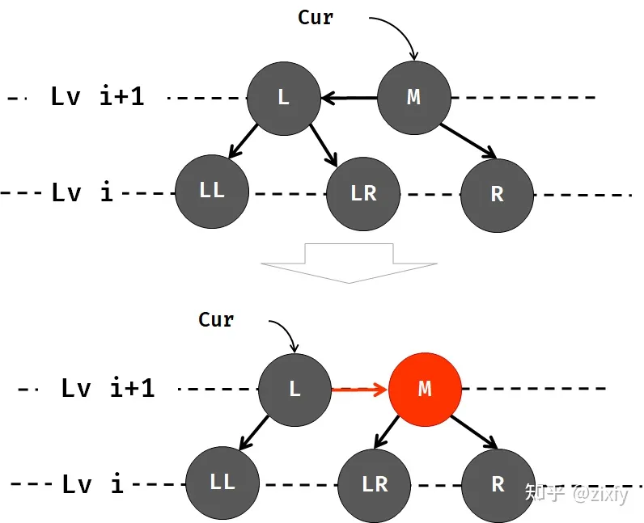
3. 如果右节点与父结点是同一层，那么执行LL旋转就会导致出现连续水平右路。因为原本是一颗稳定的AA树，所以我们肯定右节点的子结点肯定都是低一层的，不然不执行LL旋转，就会出现连续水平右路。教科书的描述中，执行一次LL旋转后，再执行一次RR旋转就可以了。我们观察调整前后的结点变化，发现这种情况，只需要将根结点提高一层，也就是++level，就解决了问题。同样的，这时候我们需要回溯检查。
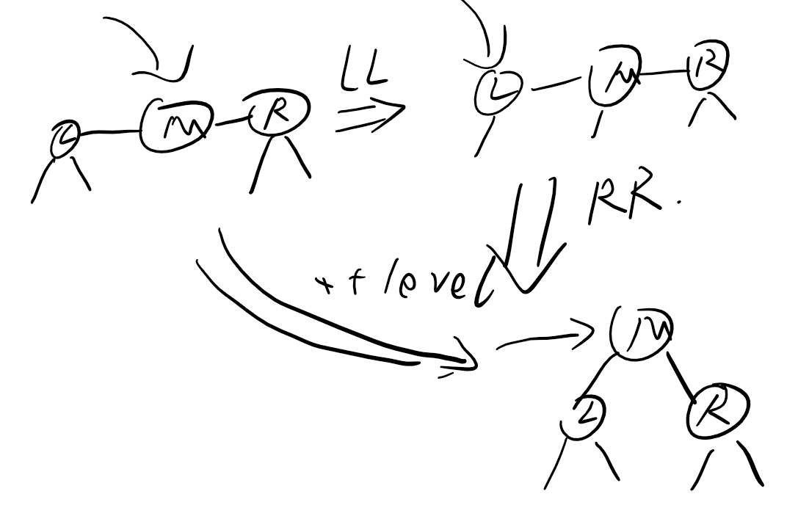
4. 如果当前结点就是父节点的右节点，并且还出现了水平左路，呈一个来回的路径，这时候执行LL旋转，会导致父节点出现了连续水平右链。所以还要再进行一次RR旋转。这种情况，我们需要在父结点的位置执行RL操作，并且将左链的结点level加一，需要向上回溯检查。
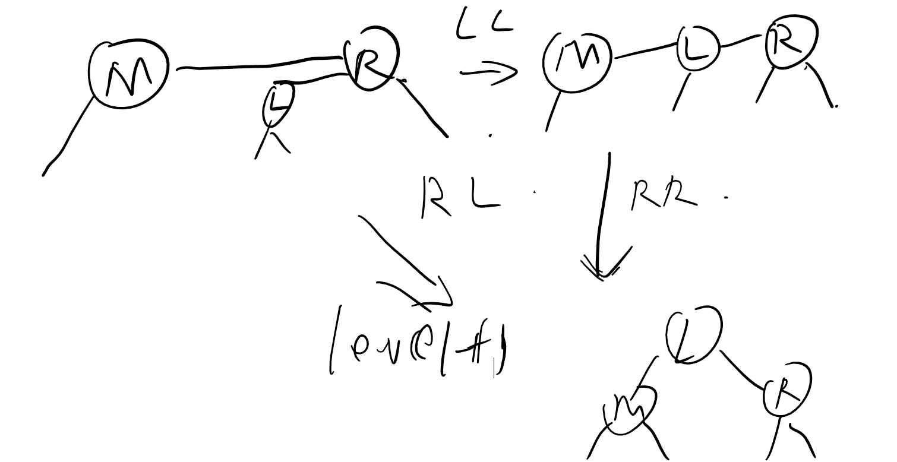

在上述的几种情况中，有些复杂。因为进行旋转操作时，不同情况下，对应的旋转根节点有区别。这造成了我们的写代码实现的困难，同时，只有2层在根节点时，我们需要写额外的代码进行区分。
为了简化，并且也符合栈回溯的逻辑，我们只考虑插入位于上个结点左右的情况。

1. 变化的结点在当前结点的左边，检查左子结点level，如果低一层，说明正常，可以返回，否则，检查右子结点是第一层还是高一层，做出对应的处理。之后在上一层继续检查。
2. 变化的结点在当前结点的右边，检查是否出现了连续右路，如果有，进行一次旋转，如果没有，则可以直接返回。这时候，不需要再考虑是否出现连续左路。

##### 插入

根据上述的分析，我们实现插入函数。

```cpp
int getLevel(TreeNode *p) {
    if (p == nullptr) {
        return 0;
    }
    return p->level;
}

void insert(T i) {
    TreeNode *p = root;
    if (p == nullptr) {
        root = new TreeNode(i);
        return;
    }
    std::stack<TreeNode*> st;
    while (p != nullptr) {
        st.push(p);
        if (p->data == i) {
            return;
        } else if (p->data < i) {
            p = p->right;
        } else {
            p = p->left;
        }
    }
    p = st.top();
    if (p->data < i) {
        p->right = new TreeNode(i);
    } else {
        p->left = new TreeNode(i);
    }
    while (!st.empty()) {
        p = st.top();
        st.pop();
        int tmp = p->level;
        if (p->data > i) {//检查水平左路
            if (tmp > getLevel(p->left)) {
                return;
            } else {
                if (tmp == getLevel(p->right)) {
                    ++p->level;
                    continue;
                } else {
                    LL(p);        
                }
            }
        } else {
            if (tmp == getLevel(p->right) && (tmp == getLevel(p->right->right))) {
                RR(p);
                ++p->level;
            }
        }
        if (st.empty()) {
            root = p;
        } else {
            TreeNode *q = st.top();
            if (p->data < q->data) {
                q->left = p;
            } else {
                q->right = p;
            }
        }
    }
}
```

我们写一个简易的获取level的函数，这样我们就不需要纠结nullptr的问题了。在插入函数中，回溯检查每个结点是否存在水平左路和连续右路。每个结点只会最多进行一次旋转。

##### 删除

和其他所有的二叉搜索树一样，删除结点是最麻烦的。删除的基本思路总是用后继结点代替删除，并且将自己的子结点连给父结点上。我们知道AA树的第二层往上都是有两个子结点的满树，因此删除只发生在第一层。如果删除的结点有一个子结点，那么很显然子结点是它的右节点，level相同，因此直接替换即可。如果没有子节点。我们就要考虑父节点的level，如果删除的是同层的右结点，同样可以直接返回，但是如果父节点高一层呢？删除后，父节点不再是一颗满的树，它需要进行降级。

我们要把删除结点理解为，子节点的level降低了1。这是为了方便我们进行回溯检查。

1. 首先我们考虑左边的结点level减少了1。这时候我们要分多种情况考虑。主要处理右结点是否正常。
    1. NR的level比N0低1，且NRR的level比NR低。这是最简单的一种情况，我们直接降低N0的高度就完成操作了，但是需要往上回溯检查。
    2. NR的level比N0低，但是NRR和NR的level相同。这时候，降低N0会出现连续右路，所以我们做一次RR旋转，把NR作为主结点。NR的level加一，N0level减一。由于这个操作没有改变主结点高度，所以完成了删除。
    3. NR的level与N0相同。降低N0，会导致NR比N0更高。这时候我们要检查的结点更深了。首先，我们可以肯定NR处于高level，因此NR的两个子节点NRL与NRR都比NR低。我们要检查的是NRL的右结点NRLR，如果它比NRL低，我们就可以直接进行一次RR旋转，N0level-1，让NR成为根结点，注意，这一次我们不需要再调整NR的高度了，完成删除。
    4. 如果NRLR和NRL平级，简单的RR旋转会产生连续水平右路，于是我们进行RL旋转，增加NRL的level成为根节点，N0level-1，完成删除。
    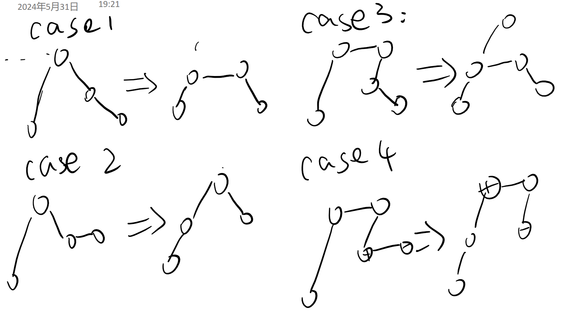
2. 接下来我们考虑右边的结点level减少了1，同样考虑父节点与左节点的高度联系。
    1. NR和N0原本是同高的，这种情况不需要进行处理，也是一颗正常AA树。为什么呢？因为我们向上迭代时，已经把下面的结点都处理好了，所以不需要担心下面的结点会有问题。
    2. NR比N0低，需要降低N0。N0必定存在NL，且NL和NR同层，降低N0的level，会出现水平左路。我们要考虑NLR的高度，如果NLR比NL低，那么我只需要一次LL旋转，就能解决路的问题，但是根节点的level会因此降低，需要回溯检查。
    3. NLR与NL同层。这时候NLR的两个子节点必然是更低的，我们执行一次LR旋转。把NLR的level+1。从而维持了平衡。由于最终节点的高度不变，所以完成了删除。
    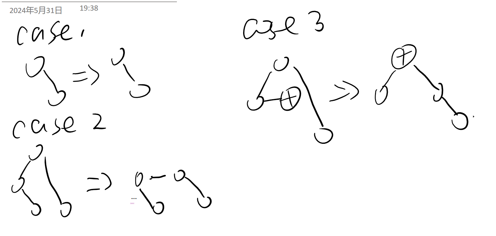

于是，AA树的删除情况我们也分析完成了。好像也是7种case，似乎并没有比红黑树好多少啊。在原代码的实现中，只有LL与RR两种旋转函数，原作者做了非常厉害的流程整合，保证了每个情况调整在5次LL与RR操作内实现，因此写的代码更加简单，但是理解难度很高。我觉得，用我这样实际的分类讨论更加直观一些，代码的流程也会比较容易理解。并且，前面我们讲的两种不需要检查的情况也能归入这里面。
AA树的删除函数如下：

```cpp
void remove(T i) {
    TreeNode *p = root;
    TreeNode *parent = nullptr;
    std::stack<TreeNode*> st;
    while (p != nullptr) {
        if (p->data == i) {
            break;
        } else if (p->data < i) {
            st.push(p);
            parent = p;
            p = p->right;
        } else {
            st.push(p);
            parent = p;
            p = p->left;
        }
    }
    if (p == nullptr) {
        return;
    }
    if (p->left && p->right) {
        TreeNode *child = p->right;
        TreeNode *childp = p;
        st.push(p);
        while (child->left != nullptr) {
            st.push(child);
            childp = child;
            child = child->left;
        }
        p->data = child->data;
        p = child;
        parent = childp;
    }
    TreeNode *child;
    if (p->left != nullptr) {
        child = p->left;
    } else {
        child = p->right;
    }
    if (parent == nullptr) {
        root = child;
    } else if (parent->left == p) {
        parent->left = child;
    } else {
        parent->right = child;
    }
    delete p;
    while (!st.empty()) {
        p = st.top();
        st.pop();
        int tmp = p->level;
        if (p->data > i) {//左节点
            if (tmp - getLevel(p->left) == 1) {
                return;
            }
            --p->level;
            if (tmp - getLevel(p->right) == 1) {
                if (tmp - getLevel(p->right->right) == 2) {//case1
                    continue;
                } else {//case2
                    RR(p);
                    ++p->level;
                }
            } else {
                if (getLevel(p->right->left) != getLevel(p->right->left->right)) {//case3
                    RR(p);
                } else {//case4
                    RL(p);
                    ++p->level;
                }
            }
        } else {//右节点
            if (tmp - getLevel(p->right) == 1) {//case1
                return;
            }
            --p->level;
            if (getLevel(p->left) != getLevel(p->left->right)) {//case2
                continue;
            } else {//case3
                LR(p);
                ++p->level;
            }
        }
        if (st.empty()) {
            root = p;
        } else {
            TreeNode *q = st.top();
            if (p->data < q->data) {
                q->left = p;
            } else {
                q->right = p;
            }
        }
    }
}
```

经典的超级长代码，不过也似乎确实比红黑树的代码略短一些，至于时间效率就不好说了。最坏的情况，AA树也会一直回溯到根节点，而且需要回溯的case中包含了旋转操作，因此性能不一定会优于红黑树。

---

#### unordered_map

c++标准库里提供了哈希表用来存储键值对，它的底层原理是红黑树。用哈希表可以实现O(1)的查找，感觉存疑，虽然Leetcode上声称是O(1)的，但我怎么也不觉得用树存储的查找能到O(1)。
哈希表可以直接用下标赋值，并且提供了检查是否存在的函数。注意，哈希表是单向的映射，所以如果想双向查找，就需要建两个哈希表。

```cpp
#include <unordered_map>
std::unordered_map<char, int> map;
map['a'] = 3;
if (map.count('a')) {
    std::cout << map['a'];
}
```

---

#### B树

前面讲过，B树的特点是每个节点的子节点数大于2，因此，它能够在每个节点上存储更多的数据。比如，一个节点上存了n个数据，那么它会有n+1个指向子节点的指针。
显而易见的，B树的高度会比二叉树矮很多，因此虽然对每个结点数据的处理时间变长了，但是它访问结点所花费的时间减少了。因此B树一般用在磁盘等IO耗时远高于CPU计算耗时的存储结构上。实际应用中，B树的阶数非常大，基本超过100。
B树同样需要维持平衡，事实上，B树是一颗高度平衡的树，它的所有叶结点都在同一层。首先，它对每个结点上能存放的数据个数都有硬性要求。我们将B树一个结点最多有多少个子结点，称为B树的阶m。因此，每个结点至多能存储m-1个关键字。它满足：

1. 根节点有至少2个孩子，即根结点至少存储1个关键字。
2. 每个叶结点有至少m/2-1(向上取整)个关键字，最多有m-1个关键字。
3. 非叶结点且非根结点有至少m/2(向上取整)个孩子，最多m个孩子。
4. key[i]与key[i+1]之间的子结点的值介于key[i]与key[i+1]之间。
5. 所有叶结点在同一层。

其实2和3两个条件是等价的。如果我们用c++的语言表达向上取整，那么每个结点中，有最少`int numd = (m-1)/2`个关键字，有最少`int numc = (m+1)/2`个孩子。最多的则不需要再讲了。这个条件限制我们不能过度的扩张B树，它保证每个结点至少都是半满的。

```cpp
struct TreeNode {
    std::vector<T> data;
    std::vector<TreeNode*> childs;
    int numd;
    TreeNode(int m): data(m-1), childs(m), numd(0){}
};
```

我们用vector存储B树结点里的数据，这样，进行查找的时候，我们就可以用二分查找了。但是其实，为了省事写顺序查找也没问题。对于单个结点上数量有限的数据集，二分查找和顺序查找拉不开效率差距，B树也不会执行特别多次的查找。使用vector访问下标很方便，这是优于链表的。但是，面对增删时，vector就有劣势了，因为插入数据后，需要把所有的结点和指针都进行右移。
有一种比较有趣的思路，用链表连接，但是是孩子和关键字交替连接。这样，找到关键字后，之后进行的删除插入都是O(1)级别了。但是这样的结构体会有点奇怪，因为要存数据和指针两种形式，也许用Union会是一个比较好的选择，同时，这样的结点只能顺序查找。

```cpp
template <typename T>
class BTree {
private:
    int m;
    struct TreeNode;
    struct Node {
        Node *next;
        union {
            T data;
            TreeNode *child;
        };
        Node(T val): next(nullptr), data(val) {};
        Node(TreeNode *p): next(nullptr), child(p) {};
    };
    struct TreeNode {
        int numd;
        Node *p;
        TreeNode(): numd(0), p(nullptr) {};
    };
    TreeNode *root;
public:
    BTree(int order): m(order), root(nullptr) {};
};
```
