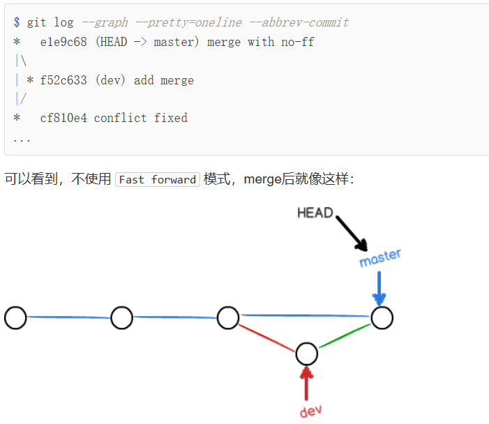

# Git Note

Tags:  `Git, Github`

[TOC]

## 什么是Git?

***Git***是一个分布式管理工具，用来控制代码的版本，存储已有的代码。

## 如何开始?

在电脑上安装`git`，`vscode`，并注册一个[*Github*](https://github.com/dashboard)
账号。

1. 在*Github*上新建一个仓库，并且对它进行命名。

2. 在本地启动`vscode`，并打开工作区文件夹。随便写点东西，比如一个[README.md](README.md)

3. 在终端创建`git`仓库，也可以让`vscode`自动去做。

    ```shell
        git config --global user.email "your_email" 
        git config --global user.name "your_name"   
        # 设置个人信息，这是提交时会留下的
        git config --global alias.st status # 给指令配置别名

        git init    # 创建新仓库
        git add .   # 把目前文件夹的所有文件上传到暂存区
        git status  # 可以查看目前文件的状态
        git commit -m "message" # 提交文件，并且留下提交信息
        git branch  # 查看当前分支情况
        git branch -M main  
        # 重命名主分支，默认的名字叫做master，不过现在都该成main了
        git branch new1 # 新建一个分支

        git remote add origin https://github.com/AkrinW/My-Notes.git    
        # 从GitHub上复制仓库的地址，这样建立一个链接关系
        git push -u origin main # 推送提交，成功上传到Github中
    ```

4. 完成`git`的创建到提交到全过程。

## 提交会失败

对我来说，提交失败的情况会经常发生，下面是我总结的一些处理办法。

首先尝试从远程仓库拉取代码，在本地和更改的文件合并后，重新尝试上传。

```shell
    git push -u origin main # Failed
    git pull origin main    # 尝试先在本地合并远程的代码
    git push -u origin main # Retry and Success.

```

---

`fatal: refusing to merge unrelated histories`

通常发生在尝试合并两个没有共同祖先的历史时。这通常是因为你的本地仓库和远程仓库的历史是不相关的，导致`git`不知道如何合并它们。

这种情况可能发生在以下情况下：

1. 你的本地仓库是空的，而远程仓库中有提交记录。
2. 你的本地仓库有提交记录，而远程仓库是新建的，没有提交记录。

为了解决这个问题，你可以使用 `--allow-unrelated-histories` 选项来允许合并不相关的历史。你可以这样操作：

```shell
    git pull origin main --allow-unrelated-histories
```

---

关闭SSL证书检查。因为我上传`Github`时并没有使用SSL，因此有时候上传会报错，所以在`git config`里关闭SSL功能

```shell
    git config --system http.sslVerify false
```

---

使用VPN时出现的问题。为了上外网，我基本常驻了*Clash*运行。但是*Clash*在全局代理时会修改转发的端口，这时`git`上传也会失败，需要在设置里修改`git`的代理时的端口。

``` shell
    git config --global --unset http.proxy  
    git config --global http.proxy http://127.0.0.1:7890
    git config --global https.proxy http://127.0.0.1:7890
```

---

## 设置仓库的保存范围

并不是工作区里所有的文件都要保存，比如自己的`.vscode`文件夹，`.exe`可执行文件等等，把这些都上传到`git`没有太大的必要。

使用`.gitignore`可以设定忽略的文件类型

```shell
# 忽略 .vscode 文件夹及其内容
/.vscode/
/html/
/test.exe
/CMakeLists.txt
/build/
/hello.exe
*.exe
/test.cpp
test.cpp

# 也可以添加不排除的例外文件
!.gitignore
```

```shell
    git rm --cached <file>
    # 在.gitignore无视文件后，用上述指令删除仓库里已保存的
    # *.exe 可以全部删除。
```

---

下面这一部分基本上来自[廖雪峰的Git教程](https://www.liaoxuefeng.com/wiki/896043488029600)，大部分我也没有亲自尝试过。
目前没有参与大项目，所有仓库只有我一个人在维护，所以里面的操作没有实践的机会。

## 本地版本控制

```shell
    git diff file   # 可以看文件的改动情况
    git log     # 查看变更日志
    git reflog  # 记录每次命令

    git reset --hard HEAD^  # 回退版本HEAD~n回退到n个版本前
    git reset --hard 1094a  # 输入版本号可以回到最新版本

    git checkout -- <file>  # 可以丢弃工作区的修改 让文件回到最近一次add或者commit的状态
    git reset HEAD <file>   # 可以丢弃在暂存区的修改
    git rm <file>   # 删除版本库里的文件
    git checkout -- <file>  # 可以把删除的文件恢复，前提是提交过到版本库里。等于从版本库复制了一份文件回来
```

---

## 分支管理

```shell
    git remote rm <name>    # 删除本地与远程仓库的链接
    git checkout -b dev     # 创建并且切换分支
    = git branch dev + git checkout dev

    git merge dev   # 把dev和主分支合并
    git branch -d dev   # 删除分支
    git switch -c dev   # 用switch指令切换分支 比checkout更容易理解
    
    git log —graph  # 可以看到命令分支合并图
    git merge --no-ff -m "merge with no-ff" dev # 合并并且保留dev分支
```

在终端看到的分支变化图片
`git`的版本控制原理是指针，需要理解合并分支后，版本指针的移动情况

>

---

## 暂存区

```shell
    git stash   # 暂存当前的更改
    git stash apply + git stash drop    # 恢复并删除    
    git stash pop   # 等同于 drop
    git stash list  # 查看暂存区
```

---

## 分支的推送

在添加新功能时，最好创建一个`feature`分支，在分支上实现后进行合并。

```shell
    git cherry-pick 4c805e2 # 将改动快速复制到另一个分支
    git branch -D feature-vulcan    # 强行删除没有合并过的分支
    git checkout -b dev origin/dev  # 创建远程的dev分支到本地
    git push origin branch-name     # 本地推送分支

    git checkout -b branch-name origin/branch-name
    # 在本地创建和远程分支对应的分支，最好保持名字一致
    git branch --set-upstream branch-name origin/branch-name
    # 建立本地与远程分支的关联
    git rebase  # 将本地的分支提交整理为直线
```

---
`tag`和`commit`的区别在于，`tag`不一定要在每次提交的时候写好。
在使用上会更灵活一点。

```shell
    git tag <tagname>       # 打标签
    git tag -a <tagname> -m "blabla"    # 可以指定标签信息
    git tag -d <tagname>    # 删除标签
    git push origin <tag>   # 推送标签

    # 删除远程的标签
    git tag -d v0.9
    git push origin :refs/tags/v0.9

```

---
