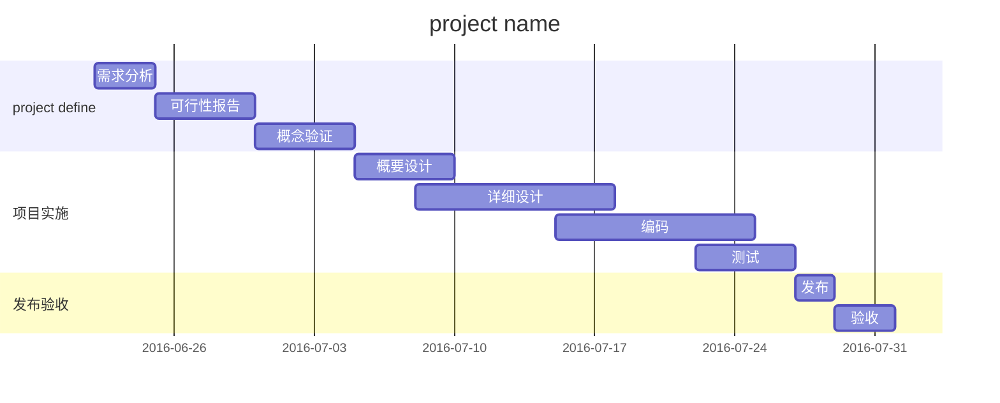

[TOC]


# 一级标题
## 二级标题
### 三级标题
#### 四级标题
###### 六级标题
##### 五级标题
###### 六级标题

*斜体*
**粗体**
***粗斜体***

换行

换行结束

>引用内容
引用2行
引用3
>>嵌套引用

结束引用

[链接名字](链接地址)
[Github地址](https://github.com/dashboard)


* 无序列表
第二行
第三行
* 第二个无序列表
* 第三个无序列表

结束

1. 有序列表1Why This Approach?

2. 有序列表2
列表内
3. 有序列表3
    1. 加tab，控制列表层级
    2. 嵌套
4. 回到第一层

结束

--- 
分割线

需要隔一行使用
---

~~删除字~~

<u>下划线</u>

`代码块 hello world`

```cpp
#include <iostream>
int main() {
    std::cout << "hello world";
}
```

表格
|项目|价格|数量|
|:-|:-:|-:|
|计算机|\$1650|5|
|手机|$33|3|
|管线|$3|20|

在分割行设定对齐,":-"居左,":-:"居中,"-:"居右

加反斜杠显示符号本身
\\
\+
\-
\~

脚注[^1],脚注会自动跳转到文章结尾

[^1]:脚注，会自动到文章结尾，但是无所谓写在哪里
脚注的第二行

跳过脚注后回到原来位置


写公式
$$E=mc^2$$

甘特图


- [ ] 待办事项
- [x] 了解markdown语法
    - [ ] 用markdown完成笔记
    - [ ] 把原笔记移植为markdown格式

